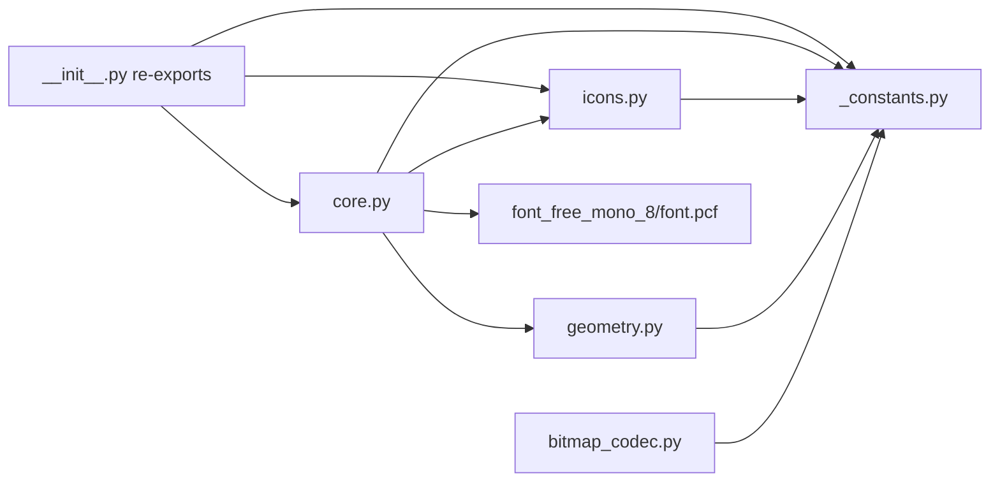

# `display` package -- architecture and design

Developer-facing architecture doc for the ``lib/display/`` package.
For install + usage see the project root [README.md](../../README.md).

## Purpose

MakeCode-style Python display library driving an 8x8 WS2812b NeoPixel
matrix from a YD-RP2040 running CircuitPython 10.1.4.

## Hardware context

| Component | Detail |
|-----------|--------|
| MCU board | YD-RP2040 (RP2040, 264 KB SRAM, 16 MB flash) |
| LED matrix | 8x8 WS2812b (64 NeoPixels) |
| Data pin | GP0 -> 3.3V-to-5V level shifter -> WS2812b DIN |
| Wiring | Progressive left-to-right, bottom-up (strip index 0 = bottom-left) |
| Level shifter | Required (RP2040 is 3.3 V logic, WS2812b wants 5 V) |

The library hides the physical wiring behind a pre-computed coordinate
LUT (see [geometry.py](geometry.py)); callers use logical coordinates
with origin (0, 0) at top-left.

## Two-tier API

**Tier 1 -- synchronous rendering primitives** (immediate writes to the
NeoPixel buffer; no ``await``):

- `render_pattern(pattern, color=WHITE)` -- parse-and-render a
  `#`/`.` grid string or palette dict.
- `render_icon(icon, color=WHITE)` -- render an icon `Image` (e.g. `Icons.HEART`).
- `render_arrow(arrow, color=WHITE)` -- render an arrow `Image` (e.g. `Arrows.NORTH`).
- `set_pixel(x, y, color)` / `fill(color)` / `clear_screen()` /
  `clear()` / `get_pixel(x, y)`.
- `set_brightness(value)` / `set_rotation(degrees)`.

**Lifecycle:**

- `deinit()` -- release the data pin / PIO state machine. Cancels any
  ongoing animation, then deinitializes the NeoPixel buffer; the singleton
  is unusable afterwards (no re-init path). See [Singleton design &
  `deinit`](#singleton-design--deinit) below.

**Tier 2 -- async MakeCode-compatible methods** (require
`await`, cancellable):

- `show_leds` / `show_icon` / `show_arrow` -- render + hold.
- `show_string(text, color=WHITE, interval_ms=150, loop=False)` -- scroll
  text (single character displays centered). With `loop=True`, keeps
  scrolling (or holding, for short text) until cancelled by another
  display call; on short text the cancellation poll cadence is
  `interval_ms` ms, or 50 ms when `interval_ms == 0`.
- `show_number(n, color=WHITE, interval_ms=150, loop=False)` -- delegate
  to `show_string`.
- `pause(ms)` -- cancellable async sleep.
- `forever(callback)` -- sync convenience wrapper running a callback in
  an asyncio `while True` loop.

Image methods (`show_image`, `scroll_image`) are also Tier 2.

## Cooperative multitasking & `_seq`

`Display._seq` is a monotonically-increasing sequence counter. Every
display-mutating method calls `_acquire()`, which increments `_seq` and
returns the new value as a **cancellation token**. Tier 2 animations
capture the token at start and re-check it between frames via
`_is_cancelled(token)` (``True`` if `_seq` has advanced past the token).
This lets a new render cancel an ongoing scroll without explicit
task cancellation; the scroll coroutine simply returns early.

Discipline: always `await asyncio.sleep(...)` between frames in Tier 2
methods, and check `_is_cancelled(token)` on both sides of the await.

## Column-major bytes (monochrome bitmap format)

Icons, arrows, font glyphs, and mono Images all share the same internal layout: one byte per column
(column 0 = leftmost). Within each byte, bit N has numeric value 2^N (so bit 0 is the least-significant bit)
and indicates row N is lit (row 0 = top). An 8x8 mono bitmap is therefore exactly 8 bytes.

For example, let's consider letter `F`:

```
. # # # # # # .          col 0: . . . . . . . .  -> 0x00
. # . . . . . .          col 1: # # # # # # # .  -> 0x7F
. # . . . . . .          col 2: # . . # . . . .  -> 0x09
. # # # # . . .          col 3: # . . # . . . .  -> 0x09
. # . . . . . .          col 4: # . . # . . . .  -> 0x09
. # . . . . . .          col 5: # . . . . . . .  -> 0x01
. # . . . . . .          col 6: # . . . . . . .  -> 0x01
. . . . . . . .          col 7: . . . . . . . .  -> 0x00
```

Bytes: `0x00 0x7F 0x09 0x09 0x09 0x01 0x01 0x00`.

Reading the bytes back: col 1 = `0x7F` = bits 0-6 set = the vertical stem (lit rows 0-6, dark row 7). Cols 2-4 = `0x09` = bits 0 and 3 = the two horizontal bars' overlap with the stem's interior columns. Cols 5-6 = `0x01` = bit 0 only = where only the top bar extends. The duplicate-value columns (`0x09` thrice, `0x01` twice, `0x00` at both ends) are *expected* -- adjacent columns in a glyph typically share a bit pattern.

Why column-major? It makes horizontal scrolling a window-slide over a
contiguous byte array -- each frame is `buf[offset:offset+WIDTH]` with
no per-pixel recomputation.

**Persistent vs one-shot**: `Image` converts to column-major at parse
time (once, amortised over repeated `show_image`/`scroll_image` calls).
`Display.render_pattern` deliberately skips the intermediate and writes
pixels directly from the parse loop -- chosen for one-shot display
speed.

**Encoding limit**: the single-byte-per-column format caps height at 8
rows (`_MAX_HEIGHT_PER_COLUMN_BYTE`). This is distinct from display
geometry; a taller display is a storage-format redesign, not a
parameter tweak.

## `Image` coupling to module state

`Image.show_image` / `scroll_image` reference module-level
`display` / `_LUT` / `_pixels` directly rather than receiving them as
arguments or holding a reference via `__init__`. For a single-display
MCU library this tight coupling is acceptable: there is exactly one
display, and keeping Image lean (via `__slots__` with four fields) is
preferred over plumbing the singletons through every instance.

## Singleton design & `deinit`

The package exposes exactly one display: the module-level `display`
instance (`from display import display`). The NeoPixel buffer (`_pixels`),
coordinate LUT (`_LUT`), and font are likewise module-global, constructed
once at import. This is a deliberate design choice, not an oversight.

**Why single-instance.** The project drives one 8x8 matrix on one
YD-RP2040. Supporting multiple `Display` instances would require unravelling
the module-global coupling described above -- `Image` would need to carry a
reference to its owning display's `_pixels` / `_LUT`, every render method
would gain an instance-state lookup, and the lean `__slots__` Image would
grow. That is real cost (RAM per Image, an extra indirection in the render
hot path, a wider API surface) paid against a speculative requirement. The
single-display assumption is honest about the hardware and keeps the hot
path tight. If a concrete multi-display need arises, the coupling points are
documented and localized (search for `_pixels` / `_LUT` / `display` module
globals in [core.py](core.py)).

**`deinit()` as the teardown hook.** Declining multi-instance does not mean
declining lifecycle management. `display.deinit()` calls `_pixels.deinit()`,
releasing the PIO state machine and the GP0 data pin so other code (or a
soft reboot) can claim them. It first calls `_acquire()` to cancel any
in-progress Tier 2 animation, so no coroutine writes to a torn-down buffer.
There is intentionally **no re-init path**: after `deinit()` the singleton is
spent and any further render call raises. Re-initialization would reintroduce
much of the instance-lifecycle complexity that the singleton design exists to
avoid; a program that needs the display again should restart.

## Sub-module responsibilities

| Module | Responsibility (one sentence) |
|--------|-------------------------------|
| [`_constants.py`](_constants.py) | Dimensions, encoding-format limits, and color constants -- single source of truth, pure (no hardware imports). |
| [`bitmap_codec.py`](bitmap_codec.py) | Design-time conversion between row-major ASCII art and column-major bytes. |
| [`geometry.py`](geometry.py) | Pure `build_lut(rotation, dest=None)` + `xy_to_index(x, y, lut)` -- no hardware dependency. Optional `dest` lets `set_rotation` rebuild the live LUT in place (no per-rotation allocation). |
| [`icons.py`](icons.py) | Icon + arrow bitmap data and `ICON_NAMES` / `ARROW_NAMES` ordered name tuples (kept together so slot ordering cannot drift). `Icons` / `Arrows` wrapper classes exposing one `Image` attribute per name are built in `core.py` at import (each `Image` owns its own 8-byte backing block -- `bytes` slicing copies in (Circuit)Python). |
| [`core.py`](core.py) | `Display` + `Image` runtime: NeoPixel buffer, LUT, font, async methods. Only module that imports `board` / `neopixel`. |
| [`__init__.py`](__init__.py) | Public-API re-exports; guarded core import lets host-side tests load pure sub-modules without a device. |

## Dependency diagram



## Cross-refs

- Project root: [README.md](../../README.md) -- user-facing install, hardware, demo quick-starts.
- [CONTEXT_HANDOFF.md](../../CONTEXT_HANDOFF.md) -- AI-assistant handoff document, including Section 0 guidelines and the Testing-strategy section (three-tier test model).
