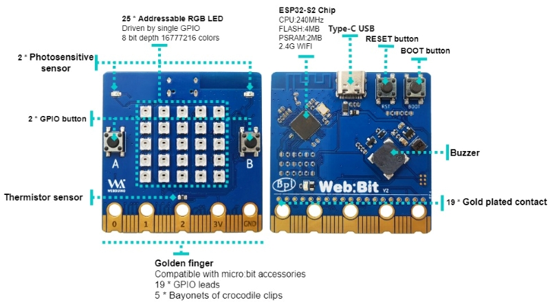

# Exp16 — BPI-Bit-S2 CircuitPython display + PlanetX buttons

Async MakeCode-style **5×5 LED** library and **A/B/C/D button** dispatcher for the [BananaPi BPI-Bit-S2](https://docs.banana-pi.org/en/BPI-Bit-S2/BananaPi_BPI-Bit-S2).

Display architecture: [`lib/display/README.md`](lib/display/README.md).


## Hardware



<small>BananaPi BPI-Bit-S2 hardware interface, unmodified. Source: [BananaPi docs](https://docs.banana-pi.org/en/BPI-Bit-S2/BananaPi_BPI-Bit-S2). Content available under the Creative Commons Attribution-ShareAlike License, by BananaPi. License file: [`Notes/bpi_bit_v2_interface_en.jpg.license`](Notes/bpi_bit_v2_interface_en.jpg.license).</small>


| Piece | Detail |
|-------|--------|
| Board | [BPI-Bit-S2](https://circuitpython.org/board/bpi_bit_s2/) (ESP32-S2, micro:bit form factor) |
| Firmware | Stock CircuitPython **10.3.0**, board-id `bpi_bit_s2` |
| LEDs | Onboard 5×5 WS2812 (25 NeoPixels), `board.NEOPIXEL` (GPIO18), brightness cap 0.20 |
| Wiring | Column-major, right-to-left. Logical (0,0) = top-left. Strip index `row + 20 - column * 5` |
| Buttons A/B | Onboard, `board.BUTTON_A` / `board.BUTTON_B` (active-low) |
| Buttons C/D | [ElecFreaks PlanetX Push Button Module](https://wiki.elecfreaks.com/en/microbit/sensor/planet-x-sensors/Plant_X_EF05017/) connected to goldfinger P13/P14 = `board.IO13` / `board.IO14` |

## This experiment's setup

These libraries are not tied to macOS or a particular Python virtual environment. Host tests need a desktop CPython with `pytest` and `pytest-asyncio`. Do not treat Blinka `board`/`keypad` as CircuitPython.

So far, I used for development: Cursor on macOS 26, CPython 3.13 in a virtual environment at `<path-to-venv>`. Do not pip-install `neopixel` or `adafruit_bitmap_font` into that venv (host tests stay off `display.core`).

On a BPI-Bit-S2 this experiment uses CircuitPython 10.3.0 (`neopixel` frozen, `keypad.Keys` built in). User-facing `asyncio` is a **bundle** library: `circup install asyncio` (pulls `adafruit_ticks`). Host CPython `asyncio` is a different library.

## Tests

From this folder, using that host CPython (not CircuitPython on the board). The suite does not import `board` or `display.core`.

```bash
<path-to-venv>/bin/pytest
```

Needs `pytest` and `pytest-asyncio` on that interpreter. Concrete path for this machine: [`tests/README.md`](tests/README.md).

## Deploy

This experiment has **no** per-folder CircuitPythonSync settings yet. The shared workspace sync still targets a different board — do not use it here.

1. Flash CircuitPython 10.3.0 ([board page](https://circuitpython.org/board/bpi_bit_s2/); 4 MB Espressif needs TinyUF2 ≥ 0.33.0 if using UF2).
2. When the CIRCUITPY drive mounts, copy `lib/display/` and `lib/buttons.py` into `CIRCUITPY/lib/`.
3. `circup install asyncio` onto that drive.
4. Add a `code.py` on the drive (none ships in this tree yet). CIRCUITPY is a deploy target, not the source of truth.

On-device `keypad` / bundle `asyncio` / PlanetX cable still need a first human device window after the flash.

## Folder structure

```
lib/display/     5×5 display package (copy of Exp14; work here, not in Exp14)
lib/buttons.py   Async A/B/C/D dispatcher
tests/           Host pytest (no board / no display.core); see tests/README.md
Notes/           Human spec + BananaPi photos (CC BY-SA, unmodified)
ai-notes/        Execution notes, plan, digests (start at INDEX.md)
```

No `code.py` or per-experiment `.vscode/` yet.

## Further reading

| What | Where |
|------|--------|
| Display package architecture | [`lib/display/README.md`](lib/display/README.md) |
| Host tests (local interpreter path) | [`tests/README.md`](tests/README.md) |
| Spec / working prefs | [`Notes/overall_goal.md`](Notes/overall_goal.md) |
| Goldfinger pinout (CC BY-SA) | [`Notes/bpi_bit_v2_goldfinger.jpg`](Notes/bpi_bit_v2_goldfinger.jpg) |
| Board interface photo (CC BY-SA) | [`Notes/bpi_bit_v2_interface_en.jpg`](Notes/bpi_bit_v2_interface_en.jpg) |
| Locks + current checkpoint | [`ai-notes/NOTES.md`](ai-notes/NOTES.md) |
| Notes router | [`ai-notes/INDEX.md`](ai-notes/INDEX.md) |
| Execution plan | [`ai-notes/plan/plan_v1.0.md`](ai-notes/plan/plan_v1.0.md) |
| Firmware | [circuitpython.org/board/bpi_bit_s2](https://circuitpython.org/board/bpi_bit_s2/) |
