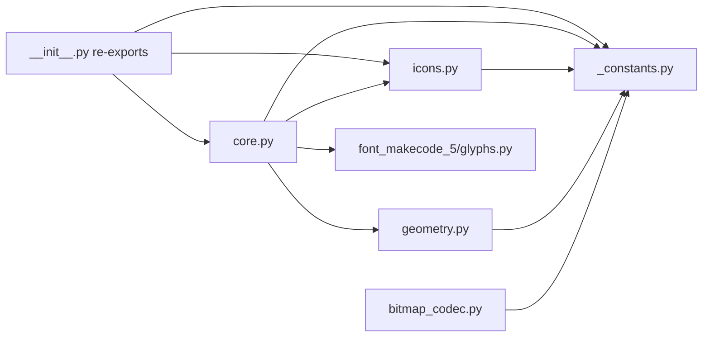

# `display` package — architecture and design

Developer-facing architecture doc for the ``lib/display/`` package.
For install + usage see the project root [README.md](../../README.md).

## Purpose

MakeCode-style Python display library driving a 5x5 WS2812 NeoPixel
matrix from a BPI-Bit-S2 running CircuitPython 10.3.0.

## Hardware context

| Component | Detail |
|-----------|--------|
| MCU board | BPI-Bit-S2 (ESP32-S2, micro:bit form factor) |
| LED matrix | 5x5 WS2812 (25 NeoPixels, onboard) |
| Data pin | ``board.NEOPIXEL`` (GPIO18) |
| Wiring | Column-major, right-to-left; strip index 0 = top-right. Formula ``idx = row + 20 - column * 5``. |
| Brightness cap | 0.20 inside the library |

The library hides the physical wiring behind a pre-computed coordinate
LUT (see [geometry.py](geometry.py)); callers use logical coordinates
with origin (0, 0) at top-left.

## Two-tier API

**Tier 1 — synchronous rendering primitives** (immediate writes to the
NeoPixel buffer; no ``await``):

- `render_pattern(pattern, color=WHITE)` — parse-and-render a
  `#`/`.` grid string or palette dict.
- `render_icon(icon, color=WHITE)` — render an `Icon` (e.g. `Emojis.HEART`). `Icon` carries no color of its own; `color` is the render color, not an override.
- `render_arrow(arrow, color=WHITE)` — alias of `render_icon` for an `Icon` from the arrow catalog (e.g. `Arrows.NORTH`), kept as a separate public method name.
- `set_pixel(x, y, color)` / `fill(color)` / `clear_screen()` /
  `clear()` / `get_pixel(x, y)`.
- `set_brightness(value)` / `set_rotation(degrees)`.

**Lifecycle:**

- `deinit()` — release the data pin / RMT peripheral. Cancels any
  ongoing animation, then deinitializes the NeoPixel buffer; *this
  instance* is unusable afterwards (no re-init path on it), but the pin
  is now free for a newly-constructed `Display()`. See [Singleton design &
  `deinit`](#singleton-design--deinit) below.

**Tier 2 — async MakeCode-compatible methods** (require
`await`, cancellable):

- `show_pattern` / `show_icon(icon, color=WHITE, interval_ms=0)` / `show_arrow` (alias of `show_icon`) — render, then wait up to `interval_ms` before returning, returning early if a later display call supersedes this one first.
- `show_image(img, offset=0, interval_ms=0)` / `scroll_image(img, step=1, interval_ms=200)` — show a `WIDTH`-column window of an `Image` / scroll through one. Thin wrappers delegating to `Image._show_image` / `_scroll_image` (internal — call the `Display` methods, not these).
- `show_string(text, color=WHITE, interval_ms=150, loop=False)` — scroll
  text (single character displays centered). With `loop=True`, keeps
  scrolling (or holding, for short text) until cancelled by another
  display call. On the short-text hold path (looping or not), a later
  display call is noticed within 50 ms, not only after the full hold
  duration has elapsed.
- `show_number(n, color=WHITE, interval_ms=150, loop=False)` — delegate
  to `show_string`.
- `pause(ms)` — cancellable async sleep; returns early if a later
  display call supersedes this one first.
- `forever(callback, sleep_between_ms=10)` — an `async` helper that calls
  `callback` again and again and never stops. `callback` is a function with
  no arguments, either a normal `def` or an `async def` (it is awaited).
  After each round it rests `sleep_between_ms` milliseconds so your other
  tasks, such as button handlers, get a turn. Start it with
  `asyncio.run(display.forever(my_function))` at the top of your program, or
  `await display.forever(my_function)` inside another `async def`.
  A negative `sleep_between_ms` raises `ValueError`.

## Cooperative multitasking & `Token`

`Token` (`__slots__ = ("_is_expired",)`) is a self-contained cancellation
marker — no back-reference to `Display`, no sequence number to compare.
`is_expired` is a read-only property backed by `_is_expired`; only
`Display._acquire()` (module-internal) writes it, so a `Token` is
immutable from outside `core.py`. `_acquire()`, called internally by
every display-mutating method, expires the *previous* token in place
(`self._token._is_expired = True`), mints a fresh one, stores it, and
returns it.

Every **Tier 2** method returns the `Token` its own `_acquire()` call
produced, so any caller can check `token.is_expired` afterwards. **Tier
1** methods (and `deinit`) do not return a token — there is nothing to
`await` after them, so a caller couldn't have anything meaningful to
check for cancellation against. A Tier 2 method that renders via a Tier
1 method (e.g. `show_pattern` → `render_pattern`) reads `self._token`
right after that call to recover the token its internal `_acquire()` minted.

Tier 2 animations capture the token at start and re-check
`token.is_expired` between frames. This lets a new render cancel an
ongoing scroll without explicit task cancellation; the scroll coroutine
simply returns early, returning the (now-expired) token, so the caller
can tell the two cases apart.

**Holds** (`pause`, the single-render waits after `show_pattern` /
`show_icon` / `show_arrow` / `show_image`, and `show_string`'s
fit-on-screen wait) use `core.py`'s `_sleep_pollable(token, total_ms)` /
`_sleep_until_cancelled(token)` instead of a single bare
`await asyncio.sleep_ms(...)`. Both are free functions — they take a
`Token` and have no dependency on any `Display` instance's state — that
chunk the wait into 50 ms pieces and
return as soon as `token.is_expired`, so a hold notices a superseding
display operation within 50 ms rather than only after its full
duration has elapsed. `_sleep_pollable` takes milliseconds and tracks a
ticks deadline (`ticks_add(ticks_ms(), total_ms)`), not a chunk-size
countdown, so scheduling jitter across many chunks cannot accumulate
drift — the non-cancelled total wait still converges to `total_ms`.
A `total_ms` of 0 or less pauses once, via `asyncio.sleep_ms(0)`, then returns. During that pause, other coroutines that are ready get a chance to run — a button check, a sensor read, another animation — before this hold continues. A synchronous Tier 1 method returns in the same call, so those other coroutines wait until the caller itself pauses.

Discipline: always `await asyncio.sleep_ms(...)` between frames in Tier 2
methods, and check `token.is_expired` on both sides of the await.

Note: as of this writing, callers must branch on `token.is_expired` after
every chained call if they want a stale sequence to stop drawing —
tokens aren't yet accepted back in as an argument to make that automatic
(see `ai-notes/design/tier2-cancellation-semantics.md` for the open
follow-up).

## Rotation during an in-flight Tier 2 animation

`set_rotation` does **not** cancel a running animation (`set_brightness`
does not either; see the cancellation-policy exceptions above). It also
redraws the frame that is already on the LEDs: logical colors are copied
out through the old LUT, the LUT is rebuilt, and those colors are written
back through the new LUT, then `show()` once. The copy uses a list allocated
in `Display.__init__`. There is no `await` in that rewrite, so it finishes
between two frames of an in-flight scroll. The scroll's next frame is drawn
with the new LUT as well.

That combination is safe by construction — these facts compose into a
mechanical guarantee:

1. **In-place LUT mutation.** `set_rotation(degrees)` rebuilds this
   `Display` instance's coordinate LUT *in place*: `build_lut(degrees,
   dest=self._lut)` (see [geometry.py](geometry.py)) writes the new table
   directly into the existing `self._lut` `bytearray`. Any code holding a
   reference to `self._lut` sees the update immediately, with no
   cache-invalidation step needed.
2. **Fresh LUT read every frame.** Every render primitive — `Display._render_ring_window`
   (`show_string`'s scroll), `Image._render_window` (`Display.show_image` /
   `scroll_image`), `Display._render_colmajor` (icon/arrow renders) — reads
   `self._lut` fresh on **every call**, not once at animation start and
   cached for the animation's duration. A long-running scroll therefore
   never has a "stale" LUT to invalidate; it just picks up whatever
   `self._lut` currently contains, frame by frame.
3. **Cooperative-scheduler atomicity.** CircuitPython's bundled
   `asyncio` is single-threaded and cooperative — nothing preempts a
   running coroutine mid-statement, only at an explicit `await`.
   `build_lut`'s rebuild loop contains no `await`, so a `set_rotation`
   call always runs to full completion strictly between two
   frame-renders of any in-flight animation, never interleaved with one.

Together: **a rotation issued while a Tier 2 animation is in flight
cannot corrupt a frame or the animation's own state.** `show_string`'s
ring-buffer `read_head` / feeder position and `Image._scroll_image`'s
`columns_scrolled` live entirely in the coroutine's own stack frame — rotation never
touches them. The current frame is shown again through the new LUT, and the
next frame uses that LUT too. The animation's logical progress is unaffected,
and a scroll's screen-relative direction/axis can change mid-scroll
(e.g. a 90°/270° rotation swaps a horizontally-scrolling animation onto
the vertical axis, since it swaps which logical axis maps to which
physical one — see [geometry.py](geometry.py)'s rotation cases) without
restarting or glitching it.

This is a **code-level, argued** guarantee (in-place mutation +
read-fresh-every-frame + scheduler atomicity), not one derived from
watching it run: static-rotation correctness and scroll-mechanics
correctness have each been confirmed on-device independently, but their
*combination* — rotating while a scroll or `Display.scroll_image` animation
is actually in flight — is, as of this writing, still pending a dedicated
on-device confirmation (see the project's test plan / session memory).

## Column-major bytes (monochrome bitmap format)

Icons, arrows, font glyphs, and mono Images all share the same internal layout: one byte per column
(column 0 = leftmost). Within each byte, bit N has numeric value 2^N (so bit 0 is the least-significant bit)
and indicates row N is lit (row 0 = top). An 8x8 mono bitmap is therefore exactly 8 bytes.

For example, let's consider letter `F`:

```
. # # # # # # .          col 0: . . . . . . . .  -> 0x00
. # . . . . . .          col 1: # # # # # # # .  -> 0x7F
. # . . . . . .          col 2: # . . # . . . .  -> 0x09
. # # # # . . .          col 3: # . . # . . . .  -> 0x09
. # . . . . . .          col 4: # . . # . . . .  -> 0x09
. # . . . . . .          col 5: # . . . . . . .  -> 0x01
. # . . . . . .          col 6: # . . . . . . .  -> 0x01
. . . . . . . .          col 7: . . . . . . . .  -> 0x00
```

Bytes: `0x00 0x7F 0x09 0x09 0x09 0x01 0x01 0x00`.

Reading the bytes back: col 1 = `0x7F` = bits 0-6 set = the vertical stem (lit rows 0-6, dark row 7). Cols 2-4 = `0x09` = bits 0 and 3 = the two horizontal bars' overlap with the stem's interior columns. Cols 5-6 = `0x01` = bit 0 only = where only the top bar extends. The duplicate-value columns (`0x09` thrice, `0x01` twice, `0x00` at both ends) are *expected* — adjacent columns in a glyph typically share a bit pattern.

Why column-major? It makes horizontal scrolling a window-slide over a
contiguous byte array — each frame is `buf[offset:offset+WIDTH]` with
no per-pixel recomputation.

**Persistent vs one-shot**: `Image` converts to column-major at parse
time (once, amortised over repeated `Display.show_image`/`scroll_image` calls).
`Display.render_pattern` deliberately skips the intermediate and writes
pixels directly from the parse loop — chosen for one-shot display
speed.

**Encoding limit**: the single-byte-per-column format caps height at 8
rows (`_MAX_HEIGHT_PER_COLUMN_BYTE`). This is distinct from display
geometry; a taller display is a storage-format redesign, not a
parameter tweak.

## `Image` rendering: no fixed display of its own

`Image._show_image` / `_scroll_image` / `_render_window` — the internal
implementations behind the public `Display.show_image` / `scroll_image`
methods — take the acting `Display` instance as an explicit parameter
(`disp`). An `Image` has no display of its own; it renders to whichever
`Display` calls it (`Display.show_image`/`scroll_image` pass `self`).
This keeps `Image` lean (`__slots__` with four fields, no `Display`
reference to keep in sync) while still supporting more than one live
`Display` instance.

`Icon` (the type behind `Emojis.*` / `Arrows.*`) has *no* such coupling
either — it is a plain `__slots__ = ("_data",)` bitmap with no reference
to any `Display` at all. All rendering happens in `Display.render_icon`,
which reads `icon.columns` and writes to `self._pixels` itself; `Icon`
never touches display state.

## Singleton design & `deinit`

The package ships one ready-made display: the module-level `display`
instance (`from display import display`), for the common case of "one
matrix, one program." That said, `Display` itself is not a true
singleton — each instance owns its own NeoPixel buffer (`self._pixels`),
coordinate LUT (`self._lut`), and cancellation token (`self._token`),
constructed fresh in `__init__`. Constructing `Display()` claims the
data pin's RMT peripheral; constructing a *second* one while an existing
instance is still live raises (the pin is already claimed by the first)
— this is enforced by hardware, not by application-level bookkeeping.

**`deinit()` as the teardown *and* hand-off hook.** `d.deinit()` calls
`self._pixels.deinit()`, releasing the RMT peripheral and the GPIO18 data
pin so other code (a different peripheral, a fresh `Display()`, or a soft
reboot) can claim them. It first calls `_acquire()` to cancel any
in-progress Tier 2 animation, so no coroutine writes to a torn-down
buffer. There is **no re-init path *on that instance*** — `d` itself must
be discarded, any further call on it raises — but the freed pin means a
*new* `Display()` can be constructed right after, with a clean buffer,
LUT, and token, entirely independent of `d`. A program that wants to
free the pin *and* stay done with the display can simply not construct a
new one; a program that wants to reconfigure and resume can construct one.

## Sub-module responsibilities

| Module | Responsibility (one sentence) |
|--------|-------------------------------|
| [`_constants.py`](_constants.py) | Dimensions, encoding-format limits, and color constants — single source of truth, pure (no hardware imports). |
| [`bitmap_codec.py`](bitmap_codec.py) | Design-time conversion between row-major ASCII art and column-major bytes. |
| [`geometry.py`](geometry.py) | Pure `build_lut(rotation, dest=None)` + `xy_to_index(x, y, lut)` — no hardware dependency. Optional `dest` lets `set_rotation` rebuild the live LUT in place (no per-rotation allocation). |
| [`icons.py`](icons.py) | Emoji + arrow bitmap data and `EMOJI_NAMES` / `ARROW_NAMES` ordered name tuples (kept together so slot ordering cannot drift). `Emojis` / `Arrows` wrapper classes exposing one `Icon` attribute per name are built in `core.py` at import (each `Icon` owns its own `WIDTH`-byte backing block — `bytes` slicing copies in (Circuit)Python). |
| [`core.py`](core.py) | `Display` + `Image` runtime: NeoPixel buffer, LUT, font, async methods. Only module that imports `board` / `neopixel`. |
| [`__init__.py`](__init__.py) | Public-API re-exports; guarded core import lets host-side tests load pure sub-modules without a device. |

## Dependency diagram



## Cross-refs

- Project root: [README.md](../../README.md) — user-facing install, hardware, demo quick-starts.
- [CONTEXT_HANDOFF.md](../../CONTEXT_HANDOFF.md) — AI-assistant handoff document, including Section 0 guidelines and the Testing-strategy section (three-tier test model).
